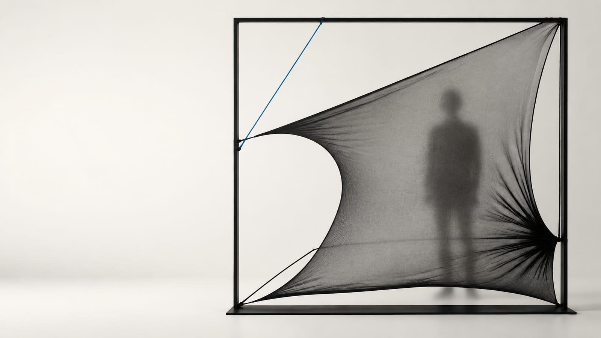

# Thesis Overview — Learning Boundary

## Purpose of this document

This page is a concise introduction to the thesis project: what it investigates, why the problem is architectural, how the proposed agent differs from ordinary responsive automation, what will be prototyped, and what the research intends to contribute.

The filename is retained so existing links remain stable, but this is **not a presentation script or slide structure**.

## Working title

**Learning Boundary: Human–Architecture Co-Adaptation Through Movement**

## One-sentence proposition

> **Can an architectural boundary learn how people move, while allowing people to negotiate what the architecture learns to do?**



*AI-generated concept visualization / AI 生成概念图。It illustrates the proposition of the boundary as an embodied agent; it is not a photograph of a completed prototype or experiment.*

### 中文思考笔记

这里的重点不是“会动的墙”，也不是“AI 猜测人的情绪”。核心是建筑能否记住自己改变空间后，对人的移动与关系产生了什么影响，并据此逐渐调整，同时让人保持拒绝和改变它的能力。

## Thesis premise

Conventional architecture generally fixes relationships among rooms, activities, territories, and degrees of privacy in advance. Responsive systems may move or activate an element, but they usually follow a predefined relationship:

```text
event → rule → response
```

This thesis asks what changes when an architectural boundary becomes an embodied spatial agent: a system that perceives movement, retains a limited memory of previous encounters, interprets spatial patterns under uncertainty, decides whether it has sufficient reason to act, and learns from the human response to its intervention.

The proposed loop is:

```text
movement and spatial relations
            ↓
        perception
            ↓
     spatial memory
            ↓
inference with uncertainty
            ↓
observe / suggest / ask / act / remain still
            ↓
   boundary transformation
            ↓
acceptance / resistance / override / appropriation
            ↓
        memory update
```

The aim is not to optimize people into a supposedly ideal layout. It is to investigate a reciprocal condition in which people and architecture continuously affect one another.

## Research problem

Domestic relationships and activities are not spatially stable. A compact dwelling may move between working alone, resting, hosting a friend, sharing a meal, working alongside another person, and seeking separation while remaining co-present.

A fixed boundary settles access, visibility, circulation, enclosure, and territory before those relationships occur. A fully autonomous system risks replacing that rigidity with another form of control: an environment that acts on an occupant because it assumes it understands their intention.

The architectural problem is therefore not simply how to make space change. It is:

> **How can a changing boundary participate in spatial negotiation without overriding the people who inhabit it?**

## Proposed context

The working scenario is a compact urban dwelling occupied primarily by one resident, with recurring guests such as friends, partners, collaborators, or visiting family members.

This context provides two useful temporal scales:

- a primary occupant enables the agent to encounter repeated spatial patterns over time;
- recurring co-occupancy introduces changing relations of proximity, visibility, circulation, and territory.

The project does not aim to encourage either more social interaction or more isolation. It asks whether the current spatial configuration supports the relationships people are already producing through their behavior.

The scenario remains provisional and is being compared with alternatives through [Issue #1](https://github.com/AshleyGulin/agentic-architecture-thesis/issues/1).

## What the agent perceives

The research deliberately avoids strong psychological diagnosis. The agent does not need to claim that a person is lonely, anxious, uncomfortable, or seeking privacy.

It begins with observable spatial signals such as:

- trajectory and route choice;
- approach direction and clearance;
- speed change and hesitation;
- dwell location and duration;
- body orientation and interpersonal distance;
- repeated crossing, avoidance, or territorial overlap;
- occupancy count;
- direct interaction with the boundary.

These observations may support cautious spatial interpretations, but movement alone does not reveal intention. Ambiguity must remain visible in the agent's reasoning and must constrain its actions.

## Human–architecture co-adaptation

The strongest research direction is not simply for the boundary to learn where people usually walk. It is for the boundary to learn how **its own spatial actions change the way people move**.

```text
boundary state B0
        ↓
human trajectory H1
        ↓
observed response to B0
        ↓
revised boundary state B1
        ↓
new human trajectory H2
        ↺
```

Over repeated encounters, the occupant may adapt to the boundary while the boundary adapts to the occupant. This reciprocal process is the proposed meaning of **human–architecture co-adaptation**.

The research must still determine how to distinguish genuine co-adaptation from simple compliance, habituation, optimization, or one-sided control.

## Architectural object

The object of study is an **adaptive architectural boundary**, understood as a spatial element that regulates:

- access;
- visibility;
- circulation;
- proximity;
- territory;
- enclosure.

It may eventually be a curtain, membrane, screen, moving panel, or hybrid system. The thesis is not committed to a conventional wall.

### Current material direction

[Power Mesh](../research/materials/power-mesh.md) is the leading material candidate, but it is not yet a final material Decision.

Variable tension may allow the textile to shift continuously among changes in aperture, density, curvature, exposure, and opening geometry. Its softness may also permit direct physical override. These are material and human-agency Hypotheses that must be tested; softness does not automatically make a boundary safe, legible, or non-coercive.

### 中文思考笔记

Power Mesh 是用来回答 thesis question 的实验媒介，不是 thesis 本身。选择它的理由应当是：tension 可成为输入，形变可成为空间输出，人的推、拉、绕行可以成为反馈。

## Prototype scope

The thesis will not attempt to build an entire intelligent apartment. The proposed scope is:

```text
one experimental space
+ one adaptive boundary
+ one constrained sensing system
+ one embodied spatial agent
+ one repeated-interaction protocol
```

A first prototype may use a variable-tension textile panel and overhead trajectory observation. Manual Wizard-of-Oz control can simulate the agent before motors, sensors, or a learning model are introduced. This allows the project to test the architectural logic—when to act, how much to change, and how people negotiate—before adding technical complexity.

## Research method

The research is structured as a sequence rather than a single final prototype.

### 1. Material characterization

[EXP-001](../experiments/EXP-001-power-mesh-characterization.md) tests stretch direction, extension, layering, anchor configuration, curvature, recovery, visual exposure, and failure. It asks whether one documented Power Mesh product can produce repeatable and measurable states.

### 2. Spatial-action pilot

[EXP-002](../experiments/EXP-002-variable-tension-boundary.md) proposes Open, Guide, and Enclose states. A manually controlled pilot will test legibility, reversibility, direct override, and potential movement effects before autonomous actuation.

### 3. Comparative agent experiment

The later thesis experiment is expected to compare:

- **Static boundary:** no adaptation;
- **Reactive boundary:** immediate predefined rule;
- **Learning/agentic boundary:** current observations, prior encounters, uncertainty, intervention history, and occupant response affect whether and how the boundary acts.

This comparison is necessary to show whether the agent contributes something beyond movement or automation.

## Evaluation

Possible evidence will combine:

- spatial measures such as route, speed, curvature, clearance, hesitation, dwell, crossing, and interpersonal distance;
- interaction measures such as intervention timing, override, repeated adjustment, and recovery;
- participant accounts of legibility, control, predictability, intrusiveness, and spatial quality;
- longitudinal comparison of changing human behavior and changing agent policy.

These metrics are candidates, not a finalized study design. Human testing requires an approved protocol for consent, recording, privacy, safety, egress, and data retention.

## Precedent position and research gap

The current precedent set connects three partial foundations:

- *Hylozoic Ground* demonstrates a lightweight textile matrix with responsive actions;
- *The Muscle Projects* provides a precedent for proactive architectural transformation;
- *The Adaptive Architectural Layout* studies a full-scale semi-autonomous partition and shared control over five weeks.

Their relevance is documented in [Precedent Analysis](../research/precedents.md).

The provisional gap is that existing responsive or robotic systems often connect immediate inputs, explicit commands, or predefined conditions to architectural responses. Less established is how a boundary might remember repeated embodied encounters, learn the relationship between its configuration and subsequent human behavior, act under uncertainty, and treat human acceptance or rejection as part of future adaptation.

This gap remains provisional until the literature review is sufficiently systematic.

## Expected contribution

The thesis aims to contribute:

1. **An architectural proposition:** the boundary as an adaptive participant rather than a fixed separator.
2. **An interaction model:** embodied movement and direct physical negotiation as interfaces with intelligent architecture.
3. **An agent model:** perception, limited memory, spatial inference, uncertainty, action restraint, and feedback connected to physical transformation.
4. **An experimental framework:** a comparison among static, reactive, and learning architectural behavior across repeated encounters.

## What the thesis is not

The project is not primarily:

- an emotion-recognition or mental-health system;
- a complete smart-home platform;
- an LLM controlling consumer devices;
- a fully autonomous robotic apartment;
- a search for one objectively “best” layout;
- a demonstration that movement alone reveals human intention.

## Current open decisions

1. Which domestic situation creates the clearest spatial conflict and repeated interaction?
2. Which small set of trajectory indicators can be observed responsibly?
3. Does Power Mesh produce sufficiently repeatable, safe, and legible spatial states?
4. What should the agent remember, and when should uncertainty make it remain still?
5. What evidence would distinguish co-adaptation from compliance or habituation?

## Current status

The thesis framing, material hypotheses, starter precedents, and two preliminary experiment protocols are documented. No material experiment or human study has yet produced Evidence. The next stage is to narrow the scenario, characterize the material, and verify the literature gap before committing to actuation or a learning architecture.
