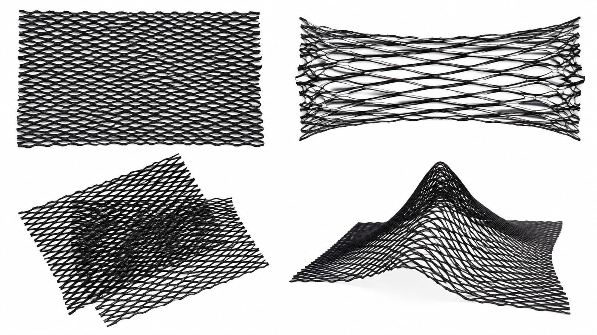

# Power Mesh: A Negotiable Adaptive Architectural Boundary

## Status and provenance

- **Status:** Leading material candidate; not a final thesis Decision.
- **Source:** Student material research supplied on 2026-09-03.
- **Evidence status:** Proposed properties, spatial effects, and human responses below are Hypotheses until documented by a material test or a verified Source.
- **Related inquiry:** [Q3](../../questions/question-tree.md#q3), [C3](../../claims-and-evidence/evidence-matrix.md#c3), and [C6–C9](../../claims-and-evidence/evidence-matrix.md#c6).

## Research context

This study supports *Learning Boundary: Human–Architecture Co-Adaptation Through Movement*. It does not simply ask how fabric can open or close automatically. It asks how an architectural boundary might gradually modify space in response to movement while preserving an occupant's ability to understand, reject, and directly alter its actions.

> **Material research question:** How can variable tension transform Power Mesh from a passive textile into a negotiable architectural boundary?

Here, *negotiable* means gradual and reversible spatial proposals rather than a rigid binary decision. An occupant may still pass through, push the textile aside, pull it back, or cover it.

### 中文思考笔记

Power Mesh 不是 thesis 的答案，而是目前最值得验证的材料候选。真正要研究的不是“布会不会动”，而是材料的形变是否能成为可理解、可拒绝、可逆转的空间建议。

## Why Power Mesh?



*AI-generated material-state visualization / AI 生成材料状态示意图。The four states are design hypotheses for future testing, not photographs or Evidence from EXP-001.*

Power Mesh is commonly described as an elastic mesh textile made with a synthetic fibre and elastane. The exact fibre composition, stretch direction, recovery, aperture, and strength vary by product and must be recorded for the purchased sample.

| Candidate material property | Architectural potential to test |
| --- | --- |
| Two-way or four-way stretch | Yielding, deformation, and recovery |
| Translucency and open mesh | Gradated visual exposure, light, and airflow |
| Softness and low weight | Direct manual alteration by an occupant |
| Gathering and layering | Local changes in density and exposure |
| Sensitivity to tension | Changes in curvature, openings, and directionality |

```text
stretch / gather / twist / local pull
                    ↓
aperture / density / curvature / recovery
                    ↓
visual exposure / enclosure / opening / circulation
                    ↓
passing / detouring / pausing / pushing
```

The final row is not a causal finding. Human response must be observed rather than inferred from form.

## Preliminary hypotheses

- **H1 — Tension as spatial control:** direction, position, and intensity of tension may alter opening location, passage width, visual exposure, and enclosure.
- **H2 — Gradated intervention:** continuous material states may support an action sequence of observe → suggest → softly intervene → recover.
- **H3 — Direct override:** softness and reversible deformation may enable occupants to push, pull, or reject an intervention; this does not prove that agency is preserved.
- **H4 — Movement effect:** asymmetrical openings, local projections, or partial enclosure may affect route choice, speed, dwell, and orientation.

These hypotheses are tracked as [C6–C9](../../claims-and-evidence/evidence-matrix.md#c6).

## Planned material characterization

Use at least six identical 20 × 20 cm samples, mark a 5 × 5 cm grid, keep background/light/camera constant, change one variable at a time, and assign IDs M01–M06.

### Test A — Direction of stretch

Compare horizontal, vertical, and diagonal stretching: applied load or displacement, aperture geometry, edge curling, local instability, recovery, and observable light transmission.

### Test B — Degree of stretch

Compare a 20 cm gauge length at 20, 25, 30, and 35 cm. Photograph front, side, and backlit views; record residual deformation after release.

### Test C — Layering and visual exposure

Compare one layer, two aligned layers, two layers rotated 45°, three local overlaps, and gathered folds using the same target and lighting. Describe observable visibility only; do not equate it with privacy or comfort without participant evidence.

### Test D — Anchor points and curvature

Compare two-point edge stretch, single-point surface pull, linear anchor row, unequal multi-point tension, and opposing points that form a local opening.

The full protocol is in [EXP-001](../../experiments/EXP-001-power-mesh-characterization.md).

## Prototype proposition

A 50 × 70 cm panel with a 3 × 4 anchor grid will test three provisional spatial states:

| State | Material action | Intended spatial effect | Human response to test |
| --- | --- | --- | --- |
| Open | Low tension; relatively flat | Visual continuity and wide passage | Direct passage |
| Guide | Asymmetrical linear pull | Offset opening and directional emphasis | Approach change or detour |
| Enclose | Regional multi-point pull and local layering | Partial enclosure and reduced exposure | Approach, dwell, or avoidance |

The follow-on [EXP-002](../../experiments/EXP-002-variable-tension-boundary.md) uses manual Wizard-of-Oz actuation before sensors or motors are selected.

## Standard record

| Field | Record |
| --- | --- |
| Sample ID | Experiment and material batch |
| Initial state | Dimensions, composition label, layers, pre-tension, fixing |
| Input | Anchor location, direction, displacement/load, duration |
| Material response | Aperture, curvature, density, recovery, instability |
| Spatial effect | Opening, screening, enclosure, directionality |
| Human response | Only if ethically approved and observed |
| Failure | Tearing, curling, slipping, overstretch, unstable position |
| Interpretation | Possible design implication, clearly separated from observation |

## Precedent synthesis

- **The Adaptive Architectural Layout:** shared control, full-scale boundary movement, and longitudinal use.
- **Hylozoic Ground:** lightweight textile matrix and distributed responsive actions.
- **The Muscle Projects:** human input mapped to real-time structural transformation.

See [precedent records](../precedents.md). Their combined relevance is an **Interpretation**, not proof that a Power Mesh learning boundary will work.

## Current material proposition

> **Hypothesis:** Variable tension may allow Power Mesh to translate small inputs into continuous variations in curvature, aperture, visual exposure, and access, creating gradual and physically rejectable boundary actions.

## 中文思考笔记

目前展示时可以说：“我选择 Power Mesh，不是因为它看起来柔软，而是因为 tension 可以成为可测量的 action，形变可以成为空间输出，而人还能直接推开或改变它。”  
但要避免说“柔软就等于自由”。你的实验正要检验它会不会反而缠绕、误导、挡路或失去形状。

## Next questions

1. Which tension changes read as spatial suggestions rather than random movement?
2. How much deformation influences a route without becoming coercive?
3. Should visual exposure and physical passage width change together?
4. How should pushing, detouring, or dwelling be recorded without overclaiming intent?
5. Should the agent remember raw trajectories or the effects of prior material states?
6. When evidence is insufficient, should the boundary remain still, suggest subtly, or ask?
